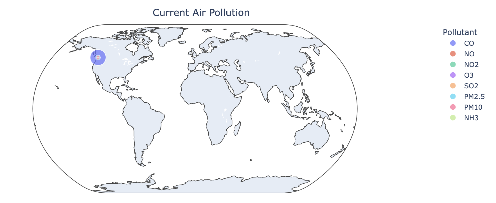
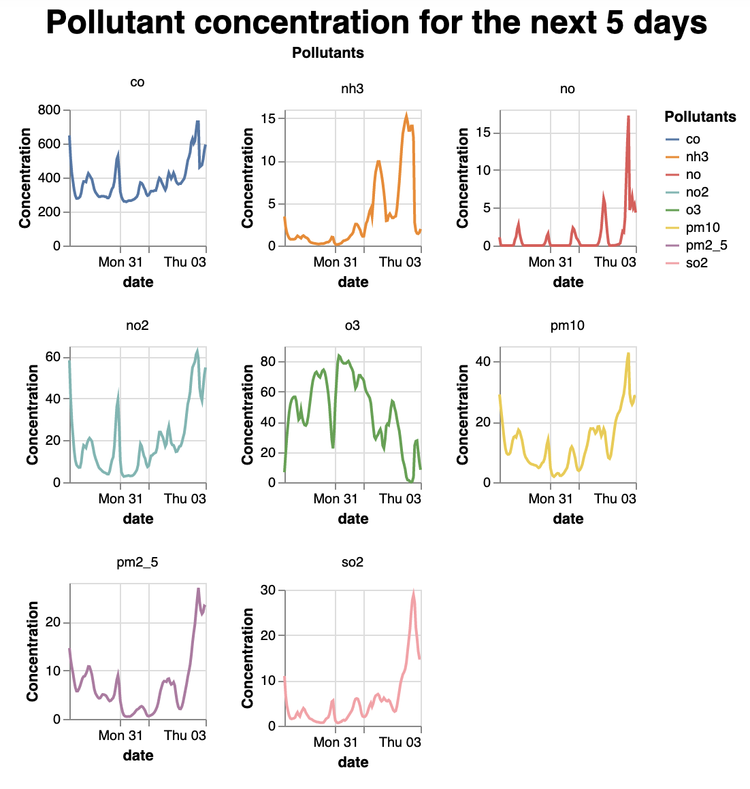

# airpyllution
[](https://codecov.io/gh/UBC-MDS/airpyllution)
[](https://github.com/UBC-MDS/airpyllution/actions/workflows/build.yml)
[](https://github.com/UBC-MDS/airpyllution/actions/workflows/deploy.yml)

`airpyllution` is a Python package for visualizing or obtaining future, historic and current air pollution data using the [OpenWeather API](https://openweathermap.org). Our goal is to enable users the ability to explore air pollution levels in locations around the world by providing visual charts and graphs. We make the data accessible and easy to comprehend in just a few lines of code.

Although there is an abundance of python weather packages and APIs in the Python ecosystem (e.g. [python-weather](https://pypi.org/project/python-weather/), [weather-forecast](https://pypi.org/project/weather-forecast/)), this particular package looks at specifically air pollution data and uses the [Air Pollution API](https://openweathermap.org/api/air-pollution) from OpenWeather. This is a unique package which provides simple and easy to use functions and allows users to quickly access and visualise data.

The data returned from the API includes the polluting gases such as Carbon monoxide (CO), Nitrogen monoxide (NO), Nitrogen dioxide (NO2), Ozone (O3), Sulphur dioxide (SO2), Ammonia (NH3), and particulates (PM2.5 and PM10).

Using the OpenWeatherMap API requires sign up to gain access to an API key.   
For more information about API call limits and API care recommendations please visit the [OpenWeather how to start](https://openweathermap.org/appid) page.
## Functions
This package contains 3 functions: 
- `get_air_pollution()`
- `get_pollution_history()`
- `get_pollution_forecast()`

### `get_air_pollution()`
Fetches the air pollution levels based on a location. Based on the values of the polluting gases, this package uses the [Air Quality Index](https://en.wikipedia.org/wiki/Air_quality_index#CAQI) to determine the level of pollution for the location and produces a coloured map of the area displaying the varying regions of air quality.

### `get_pollution_history()`
Requires a start and end date and fetches historic air pollution data for a specific location. The function returns a data frame with the values of the polluting gases over the specified date range.

### `get_pollution_forecast()`
Fetches air pollution data for the next 5 days for a specific location. The function returns a time series plot of the predicted pollution levels.

## Installation

```bash
$ pip install airpyllution
```
## Usage and Example
[](https://airpyllution.readthedocs.io/en/latest/)

1. Create an [OpenWeather API Key](https://openweathermap.org/appid)
2. Install airpyllution
3. Refer to [ReadTheDocs](https://airpyllution.readthedocs.io/en/latest/) for a usage guide and examples.

To use the package, import the package with following commands:
```
from airpyllution.airpyllution import get_air_pollution
from airpyllution.airpyllution import get_pollution_history
from airpyllution.airpyllution import get_pollution_forecast
```

Retrieve historic pollution data with specified date range and location:
```
get_pollution_history(1606488670, 1606747870, 49.28, 123.12, api_key)
```

Generate an interactive map containing current pollution data by location:

```
get_air_pollution(49.28, 123.12, api_key, "Current Air Pollution")
```



Generate a time-series scatterplots of forecasted air pollution data:
```
import altair as alt
alt.renderers.enable("html");

get_pollution_forecast(49.28, 123.12, api_key)
```


## Contributors 
- Christopher Alexander (@christopheralex)
- Daniel King (@danfke)
- Mel Liow (@mel-liow)
## Contributing

Interested in contributing? Check out the contributing guidelines. Please note that this project is released with a Code of Conduct. By contributing to this project, you agree to abide by its terms.
## License

`airpyllution` was created by Christopher Alexander, Daniel King, Mel Liow. It is licensed under the terms of the MIT license.

## Credits

`airpyllution` was created with [`cookiecutter`](https://cookiecutter.readthedocs.io/en/latest/) and the `py-pkgs-cookiecutter` [template](https://github.com/py-pkgs/py-pkgs-cookiecutter).
